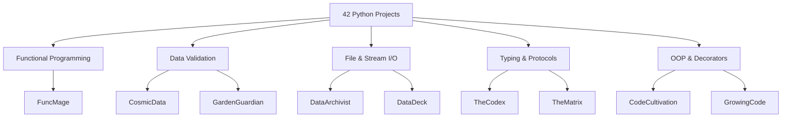

# 42 Python Projects

> **Source →** [github.com/AhmadNajiKam/42_Python_Projects](https://github.com/AhmadNajiKam/42_Python_Projects)

A living reference for every Python project completed at [42 School](https://www.42network.org/) — covering functional programming, data validation, file I/O, typing, and more.

---

## What's in here?

| Section | What you'll find |
|---|---|
| [Tutorials](tutorials/index.md) | Step-by-step walkthroughs that build real concepts from scratch |
| [How-To Guides](how-to/index.md) | Focused recipes for specific tasks (submitting exercises, debugging, testing) |
| [Reference](reference/index.md) | Authoritative descriptions of every project, concept, and rule |
| [Projects](projects/index.md) | Deep-dives into individual project modules |

---

## Project Map



---

## Quick Start

```bash
# Clone the repo
git clone https://github.com/AhmadNajiKam/42_Python_Projects.git
cd 42_Python_Projects

# Enter any project
cd FuncMage

# Install dependencies (if any)
pip install -r requirements.txt

# Run the main script
python main.py
```

---

## Skills Covered

- **Lambdas & Higher-Order Functions** — `map`, `filter`, `functools.reduce`
- **Closures & Decorators** — wrapping callables, `functools.wraps`, retry/timer patterns
- **Pydantic v2** — `BaseModel`, field validators, nested models, environment config
- **Generators & Iterators** — `yield`, lazy evaluation, generator expressions
- **Python Typing** — `Protocol`, `TypeVar`, generics, `Annotated`
- **File Streams** — context managers, binary vs text mode, stream buffering
- **`python-dotenv`** — `.env` loading, `BaseSettings`

!!! tip "New to 42?"
    Start with the [First Decorator Tutorial](tutorials/first-decorator.md) — it introduces
    closures, `functools.wraps`, and the `@` syntax in a single guided session.
